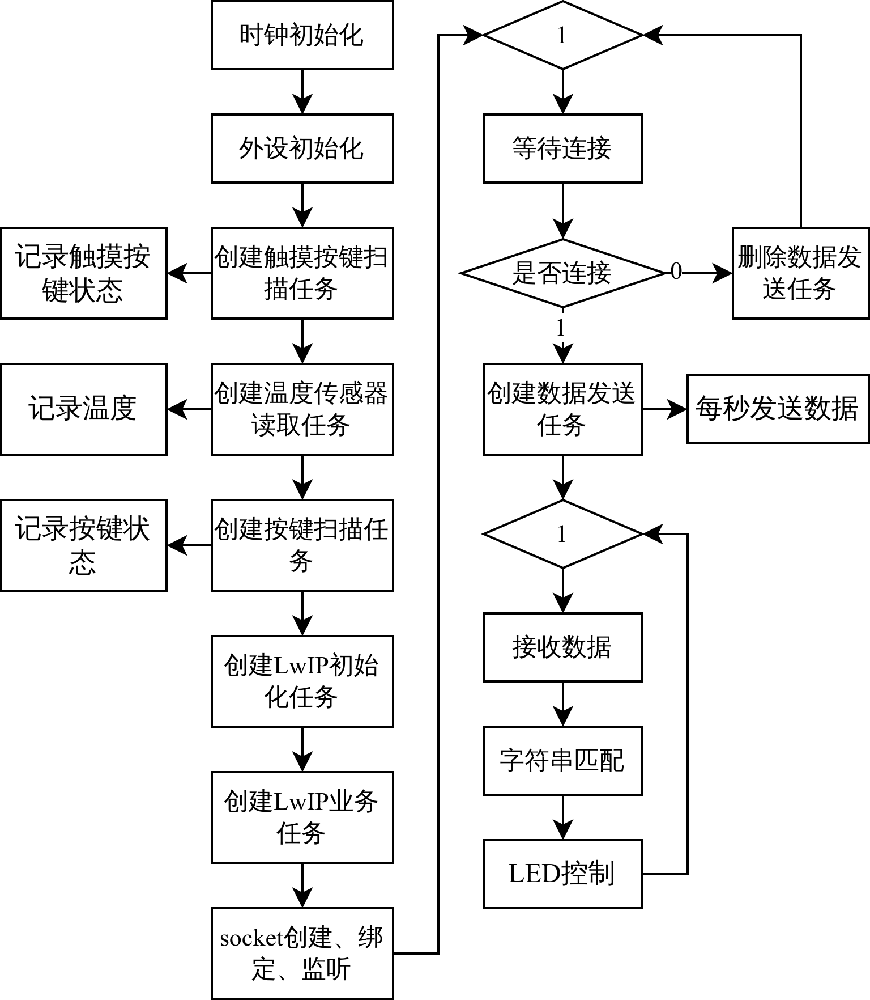

# FRDM-MCXN947 Peripherals Control Based on LwIP

基于 NXP FRDM-MCXN947 开发板，通过板卡上的 RJ45 以太网口与 PC 连接，使用 LwIP 协议与主机进行数据传输。开发板集成有温度传感器、按键、触摸按键等外设，板卡可将温度，触摸与按键信息发送至主机；主机可通过 LwIP 控制板卡 RGB LED。

# 📦 Prerequisites

开发环境：MCUXpresso VSCode 扩展。项目所用到的工具链、库如下：

1. 编译器：arm-none-eabi-gcc v13.3.1
2. 调试器：arm-none-eabi-gdb v14.2
3. MCUXpresso SDK：SDK_2.x_FRDM-MCXN947 v2.16
4. [Linkserver](https://www.nxp.com.cn/design/design-center/software/development-software/mcuxpresso-software-and-tools-/linkserver-for-microcontrollers:LINKERSERVER)：v1.6.121

# 📜 Documentation

## ⛓️ Workflow

    

## 📽️ More details

1. 项目详细说明，[CSDN：基于FRDM-MCXN947的LwIP通信与外设控制(LwIP+TSI+ADC+FreeRTOS)](https://blog.csdn.net/weixin_46422143/article/details/141459566)
2. 项目功能演示，[B站：基于FRDM-MCXN947的LwIP通信与外设控制](https://www.bilibili.com/video/BV1g8WQemEgV/)
